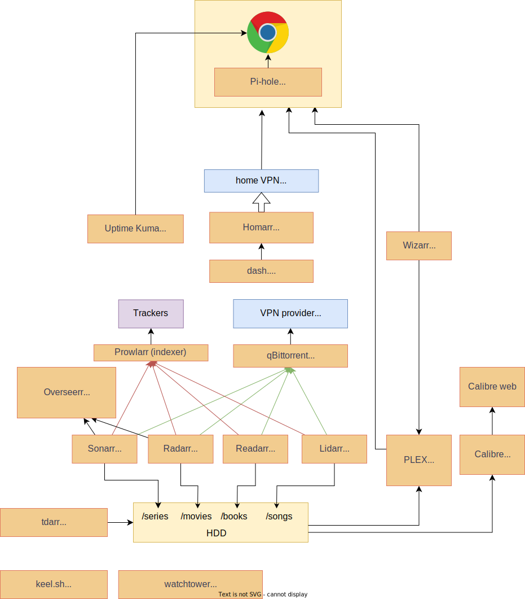

## Home media management

This project is for learning and collecting useful media management components and create helm charts/docker composes from them to be able to run them under a local kubernetes cluster or just with Docker Desktop.

### Services



#### Media server

- [x] [Plex](https://www.plex.tv/)
  - media server and web client for serving series, movies, videos and music files
- [x] [Calibre](https://calibre-ebook.com/)
  - [x] [Calibre web](https://github.com/janeczku/calibre-web)

#### Media automation

- [x] [Lidarr](https://lidarr.audio/)
- [x] [Radarr](https://github.com/Radarr/Radarr)
- [x] [Sonarr](https://github.com/Sonarr/Sonarr)
- [x] [Readarr](https://github.com/Readarr/Readarr)
- [x] [Overseerr](https://github.com/sct/overseerr)

#### Plex plugins

- [ ] [Kitana](https://github.com/pannal/Kitana)
- [ ] [Sub-Zero bundle](https://github.com/pannal/Sub-Zero.bundle)


#### Indexer management

- [x] [Prowlarr](https://github.com/Prowlarr/Prowlarr)

#### Torrent agent

- [x] [qBittorrent](https://github.com/qbittorrent/qBittorrent)

#### file management

- [x] [Tdarr](https://home.tdarr.io/)

#### Component management

- [x] [Homarr](https://homarr.dev/)
- [x] [dashdot](https://getdashdot.com/)
- [x] [Uptime kuma](https://github.com/louislam/uptime-kuma)

#### Traffic management

- [x] [Pi-hole](https://github.com/pi-hole/pi-hole)

#### User management

- [x] [Wizarr](https://github.com/Wizarrrr/wizarr)

#### Container management

- [ ] [keel.sh](https://github.com/keel-hq/keel)
- [x] [watchtower](https://github.com/containrrr/watchtower/)
  - create a symlink to your docker config.json: `ln -s ~/.docker/config.json ~/.docker/config-linked.json`

### File structure

- skaffold:
  Skaffold service config files. These configs contains the building, deploying and port forwarding of helm charts.
- helm:
  Custom helm carts
- docker-componse:
  Custom docker compose files
- scripts:
  required bash scripts

### Commands

#### Skaffold managed services (not implemented yet)

- to start services run:

  ```
  npm run skaffold:start
  ```

- to stop services run:

  ```
  npm run skaffold:stop
  ```

  #### Docker compose managed services

- to init docker compose network run:

  ```
  npm run init
  ```

- to start services run:

  ```
  npm run compose:start
  ```

- to stop services run:

  ```
  npm run compose:stop
  ```

### Development

### Required tools

- [docker desktop](https://www.docker.com/)
- for kubernetes 
  - kubernetes cluster
  - [helm](https://helm.sh/)
  - [skaffold](https://skaffold.dev/)

#### Docker compose

- `/docker-compose/data` contains all the local configurations for the docker composes. Save this folder to keep your configured settings

#### Useful resources

- https://wiki.servarr.com/ is a consolidated wiki for Lidarr, Prowlarr, Radarr, Readarr and Sonarr
- docker image collections

  - https://hotio.dev/
  - https://docs.linuxserver.io/
  - https://github.com/onedr0p/containers

- helm charts collections
  - https://github.com/bitnami/charts
  - https://github.com/k8s-at-home/charts
